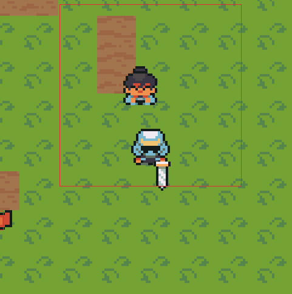
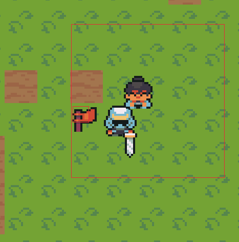

# NINJA VILLAGE

A simple 2D Top Down game which is currently in development. It is more for learning purpose. It uses the raylib library.

Here you can download and install [Raylib](https://www.raylib.com/).

To run the project you can clone it, unzip and open it in visual studio code, and start debugging or build it using Ctrl + Shift + B.

The assets used in this does not belong to me, you can see them here, [Ninja Adventure](https://pixel-boy.itch.io/ninja-adventure-asset-pack).

The basic controls for now are W for up, S for down, A for left and R for right. 

A lot of imporvements needs to be made in this project, which I will be doing in my free time. 

Here you can see the screenshots of the current phase : 

